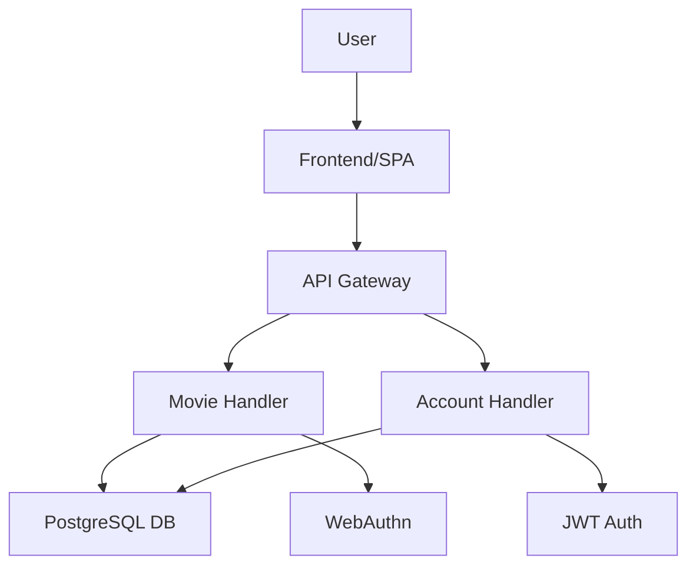
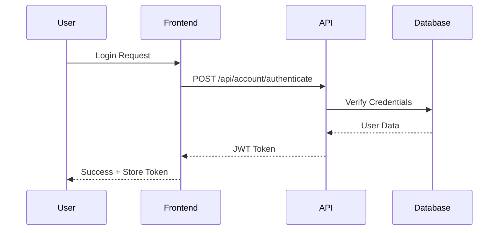

# 🔧 PhoenixFlix - Installation & Setup Guide

## 📋 Table of Contents
1. [Prerequisites](#prerequisites)
2. [JWT Setup](#jwt-setup)
3. [Mermaid Installation](#mermaid-installation)
4. [SchemaSpy Setup](#schemaspy-setup)
5. [Go Documentation Tools](#go-documentation-tools)
6. [VS Code Extensions](#vs-code-extensions)
7. [Structured Code Notes](#structured-code-notes)

---

## Prerequisites

### Required Software
- **Go**: Version 1.21 or higher
- **Node.js**: Version 18+ (for Mermaid CLI)
- **Java**: Version 11+ (for SchemaSpy)
- **PostgreSQL**: For database
- **VS Code**: Recommended IDE

---

## JWT Setup

### ✅ Already Installed!
Your project already has JWT configured:

```go
github.com/golang-jwt/jwt/v5 v5.3.0
```

### Usage Example

```go
package token

import (
    "time"
    "github.com/golang-jwt/jwt/v5"
)

// Create a new JWT token
func GenerateToken(userID int, email string, secret string) (string, error) {
    claims := jwt.MapClaims{
        "user_id": userID,
        "email":   email,
        "exp":     time.Now().Add(time.Hour * 24).Unix(), // 24 hour expiry
        "iat":     time.Now().Unix(),
    }
    
    token := jwt.NewWithClaims(jwt.SigningMethodHS256, claims)
    return token.SignedString([]byte(secret))
}

// Verify and parse JWT token
func VerifyToken(tokenString string, secret string) (*jwt.Token, error) {
    return jwt.Parse(tokenString, func(token *jwt.Token) (interface{}, error) {
        return []byte(secret), nil
    })
}
```

### Add to your .env file:
```env
JWT_SECRET=your-super-secret-key-change-this-in-production
JWT_EXPIRY=24h
```

---

## Mermaid Installation

Mermaid creates beautiful diagrams from text (perfect for documentation!).

### Install Mermaid CLI

```powershell
# Using npm (recommended)
npm install -g @mermaid-js/mermaid-cli

# Verify installation
mmdc --version
```

### Install VS Code Extension

1. Open VS Code Extensions (Ctrl+Shift+X)
2. Search for "Markdown Preview Mermaid Support"
3. Install by Matt Bierner

### Usage Example

Create a `docs/architecture.md` file:

````markdown
# System Architecture



## Authentication Flow


````

### Generate PNG from Mermaid

```powershell
# Generate diagram image
mmdc -i docs/architecture.md -o docs/architecture.png

# Or generate for specific diagram
mmdc -i diagram.mmd -o output.png -t dark -b transparent
```

---

## SchemaSpy Setup

SchemaSpy generates beautiful database documentation automatically.

### Install SchemaSpy

```powershell
# Create tools directory
mkdir -p tools
cd tools

# Download SchemaSpy
Invoke-WebRequest -Uri "https://github.com/schemaspy/schemaspy/releases/download/v6.2.4/schemaspy-6.2.4.jar" -OutFile "schemaspy.jar"

# Download PostgreSQL JDBC Driver
Invoke-WebRequest -Uri "https://jdbc.postgresql.org/download/postgresql-42.7.1.jar" -OutFile "postgresql-jdbc.jar"
```

### Create SchemaSpy Configuration

Create `tools/schemaspy.properties`:

```properties
# Database connection
schemaspy.t=pgsql
schemaspy.host=localhost
schemaspy.port=5432
schemaspy.db=phoenixflix_db
schemaspy.u=your_username
schemaspy.p=your_password
schemaspy.s=public

# Output
schemaspy.o=docs/database

# JDBC Driver
schemaspy.dp=tools/postgresql-jdbc.jar

# Options
schemaspy.norows=true
schemaspy.noimplied=true
```

### Generate Database Documentation

```powershell
# Run SchemaSpy
java -jar tools/schemaspy.jar -configFile tools/schemaspy.properties

# Open generated documentation
start docs/database/index.html
```

This creates:
- 📊 Entity Relationship Diagrams
- 📋 Table schemas and relationships
- 🔍 Column details and constraints
- 📈 Database statistics

---

## Go Documentation Tools

### Install pkgsite (Modern Go Documentation Server)

```powershell
go install golang.org/x/pkgsite/cmd/pkgsite@latest
```

### Run Local Documentation Server

```powershell
# Start documentation server
pkgsite -open

# Or specify port
pkgsite -http=:8081
```

### Generate Package Documentation

```powershell
# Generate docs for your project
go doc -all > docs/api-reference.txt

# View specific package docs
go doc GoVanilla/handlers
go doc GoVanilla/data

# View specific function
go doc GoVanilla/handlers.MovieHandler.GetTopMovies
```

### Install godoc (Alternative)

```powershell
go install golang.org/x/tools/cmd/godoc@latest

# Run godoc server
godoc -http=:6060

# Open in browser: http://localhost:6060/pkg/GoVanilla/
```

---

## VS Code Extensions

### Recommended Extensions (Auto-Install)

Your `.vscode/extensions.json` now includes:

1. **Better Comments** - Colorful code annotations
2. **Go** - Official Go language support
3. **Markdown Mermaid** - Mermaid diagram preview
4. **Markdown Preview Enhanced** - Advanced markdown preview
5. **SQLTools** - Database management
6. **SQLTools PostgreSQL Driver** - PostgreSQL support

### Install All Extensions

VS Code will prompt you to install recommended extensions automatically!

Or install manually:
```powershell
# Open VS Code
code .

# Extensions will be suggested in the bottom-right corner
# Click "Install All"
```

---

## Structured Code Notes

Your code uses a beautiful structured commenting system!

### Available Tags (Now Color-Coded!)

| Tag | Color | Purpose | Example |
|-----|-------|---------|---------|
| `!SECTION` | 🔴 Red | End of major section | `//!SECTION - Authentication` |
| `SECTION` | 🔵 Cyan | Start of major section | `//SECTION - Database Setup` |
| `STEP` | 🟢 Green | Numbered steps | `// STEP 1: Initialize logger` |
| `IMPORTANT` | 🔴 Red | Critical information | `// IMPORTANT: Must be called first` |
| `NOTE` | 🟠 Orange | General notes | `// NOTE: Consider refactoring` |
| `TODO` | 🔴 Orange-Red | Tasks to complete | `// TODO: Add validation` |
| `FIXME` | 🟠 Orange | Known issues | `// FIXME: Memory leak here` |
| `HACK` | 🟤 Dark Red | Temporary solutions | `// HACK: Workaround for bug` |
| `REVIEW` | 🟣 Purple | Needs review | `// REVIEW: Is this optimal?` |
| `RELATED` | 🟣 Indigo | Cross-references | `// RELATED: data/movie_repo.go` |
| `STUB` | 🟡 Yellow | Placeholder code | `// STUB: Implement later` |

### Usage Examples

```go
//SECTION - 1: Database Initialization
// This section handles all database connection setup and configuration
// IMPORTANT: Must run before any repository initialization

// STEP 1: Load environment variables
if err := godotenv.Load(); err != nil {
    log.Printf("Error loading .env: %v", err)
}

// STEP 2: Connect to PostgreSQL
// NOTE: Connection pooling is handled automatically
// RELATED: See data/connection.go for pool configuration
db, err := sql.Open("postgres", dbConnStr)
if err != nil {
    // TODO: Add retry logic for production
    log.Fatalf("DB connection failed: %v", err)
}

// REVIEW: Should we use connection pooling here?
db.SetMaxOpenConns(25)
db.SetMaxIdleConns(5)

//!SECTION - Database Initialization Complete
```

### Creating Documentation Chapters

Create a `docs/CODE_STRUCTURE.md`:

````markdown
# PhoenixFlix Code Structure

## Chapter 1: Application Entry Point

### Section 1.1: Initialization Sequence

**STEP 1**: Logger initialization
- Location: `main.go:38-53`
- Purpose: Set up structured logging
- Dependencies: `logger/logger.go`

**STEP 2**: Environment configuration
- Location: `main.go:66-72`
- Purpose: Load .env variables
- Important: Must load before database connection

### Section 1.2: Database Setup

**STEP 3**: PostgreSQL connection
- Location: `main.go:78-86`
- Connection string: From `DATABASE_URL` env var
- Error handling: Fatal if connection fails

## Chapter 2: Repository Layer

### Section 2.1: Movie Repository
...
````

---

## Quick Start Checklist

- [x] ✅ JWT installed and configured
- [ ] 📦 Install Mermaid CLI: `npm install -g @mermaid-js/mermaid-cli`
- [ ] ☕ Install Java (for SchemaSpy)
- [ ] 📊 Download SchemaSpy JAR
- [ ] 📚 Install pkgsite: `go install golang.org/x/pkgsite/cmd/pkgsite@latest`
- [ ] 🎨 Install VS Code extensions (auto-prompted)
- [ ] 📝 Create your first Mermaid diagram
- [ ] 🗃️ Generate database documentation

---

## Additional Resources

### Documentation Structure Template

```
docs/
├── architecture.md          # System architecture with Mermaid diagrams
├── api-reference.md         # API endpoint documentation
├── database/               # SchemaSpy generated docs
├── CODE_STRUCTURE.md       # Code organization guide
├── DEVELOPMENT.md          # Development workflow
└── diagrams/
    ├── auth-flow.mmd
    ├── data-flow.mmd
    └── component-diagram.mmd
```

### Useful Commands

```powershell
# Generate all documentation
npm run docs:generate    # (add this script to package.json)

# View Go documentation
pkgsite -open

# Generate database docs
java -jar tools/schemaspy.jar -configFile tools/schemaspy.properties

# Create diagram from mermaid
mmdc -i docs/diagram.mmd -o docs/diagram.png
```

---

## Support

For issues or questions:
- 📧 Email: thephoenixflix@gmail.com
- 🌐 Website: https://bit.ly/thephoenixflix
- 💻 GitHub: https://github.com/PhoenixWeaver

---

**Happy Coding! 🚀🔥**

