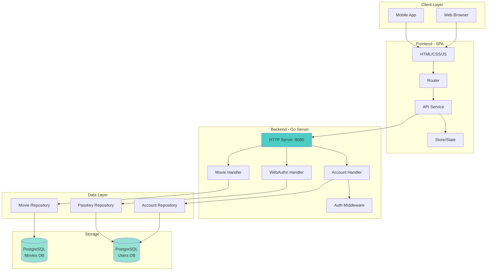
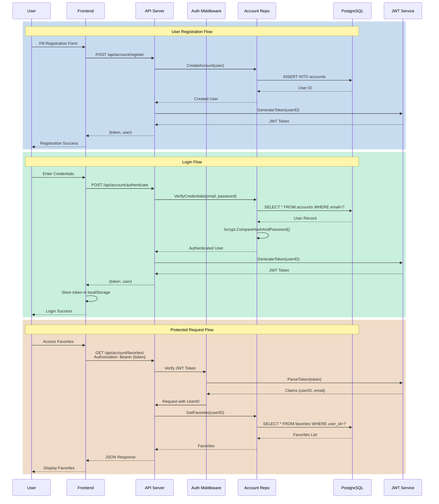
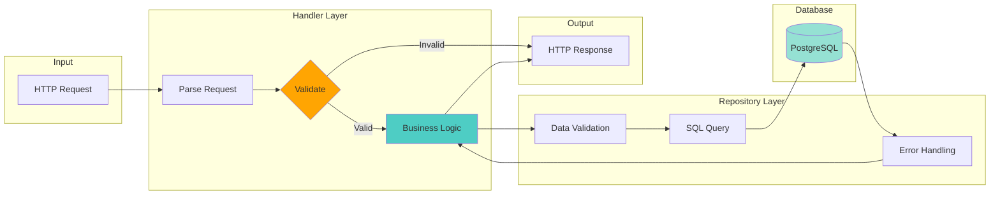
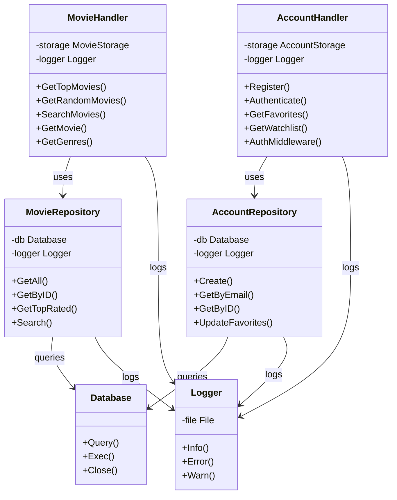
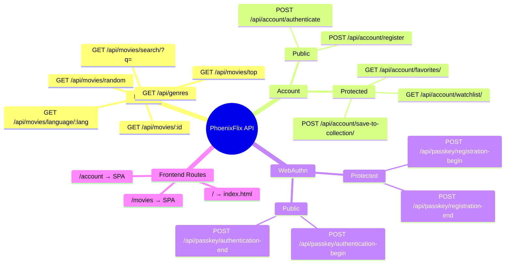
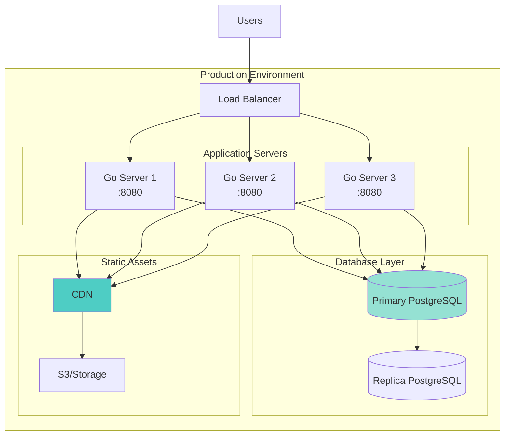
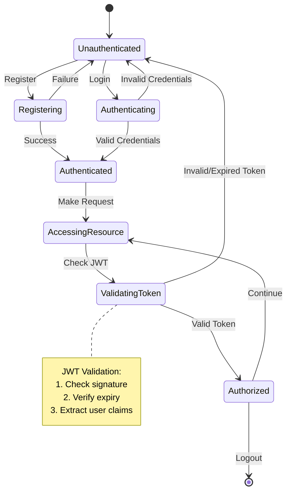
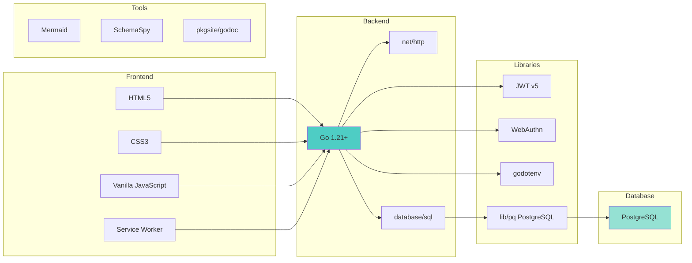
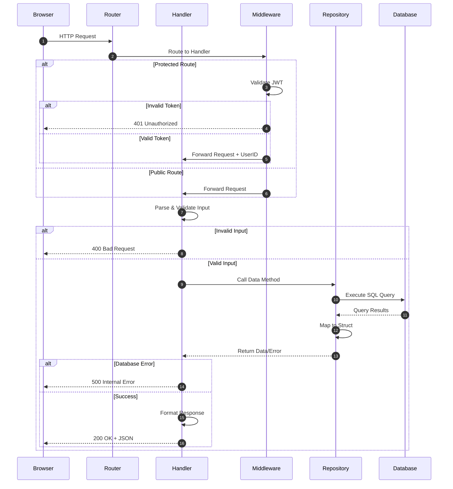

# 🏗️ PhoenixFlix Architecture Documentation

## System Overview

PhoenixFlix is a multi-purpose streaming platform with dual database architecture, WebAuthn authentication, and family-friendly content management.

---

## High-Level Architecture



---

## Authentication Flow



---

## Data Flow Architecture



---

## Component Relationships



---

## Database Schema (ERD)

```mermaid
erDiagram
    MOVIES ||--o{ MOVIE_GENRES : has
    MOVIES {
        int id PK
        string title
        int year
        string language
        string poster_url
        string trailer_url
        text description
        float rating
        timestamp created_at
    }
    
    GENRES ||--o{ MOVIE_GENRES : includes
    GENRES {
        int id PK
        string name
        string slug
    }
    
    MOVIE_GENRES {
        int movie_id FK
        int genre_id FK
    }
    
    ACCOUNTS ||--o{ FAVORITES : has
    ACCOUNTS ||--o{ WATCHLIST : has
    ACCOUNTS ||--o{ PASSKEYS : owns
    ACCOUNTS {
        int id PK
        string email UK
        string password_hash
        string full_name
        timestamp created_at
        timestamp updated_at
    }
    
    MOVIES ||--o{ FAVORITES : in
    FAVORITES {
        int id PK
        int user_id FK
        int movie_id FK
        timestamp added_at
    }
    
    MOVIES ||--o{ WATCHLIST : in
    WATCHLIST {
        int id PK
        int user_id FK
        int movie_id FK
        boolean watched
        timestamp added_at
    }
    
    PASSKEYS {
        int id PK
        int user_id FK
        binary credential_id
        binary public_key
        int sign_count
        timestamp created_at
    }
```



---

## API Endpoint Structure



---

## Deployment Architecture



---

## Security Flow



---

## Technology Stack



---

## Request/Response Cycle



---

## File Structure

```
BTPW_PhoenixFlix/
├── main.go                     # Application entry point
├── go.mod                      # Go module definition
├── go.sum                      # Dependency checksums
├── .env                        # Environment variables
│
├── data/                       # Repository Layer
│   ├── movie_repository.go
│   ├── account_repository.go
│   └── passkey_repository.go
│
├── handlers/                   # HTTP Handlers
│   ├── movie_handler.go
│   ├── account_handler.go
│   └── webauthn_handler.go
│
├── models/                     # Data Models
│   ├── movie.go
│   ├── account.go
│   └── passkey.go
│
├── logger/                     # Logging System
│   └── logger.go
│
├── token/                      # JWT Token Management
│   └── jwt.go
│
├── public/                     # Frontend Assets
│   ├── index.html
│   ├── app.js
│   ├── styles.css
│   ├── components/             # UI Components
│   ├── services/               # API Services
│   └── images/
│
├── docs/                       # Documentation
│   ├── architecture.md         # This file!
│   ├── api-reference.md
│   ├── database/               # SchemaSpy output
│   └── diagrams/
│
└── tools/                      # Development Tools
    ├── schemaspy.jar
    └── postgresql-jdbc.jar
```

---

**Generated with ❤️ for PhoenixFlix**

